# Capacity Planning & Resource Optimization System

[](https://python.org)
[](https://fastapi.tiangolo.com/)
[](https://reactjs.org/)
[](https://docker.com)
[](https://tensorflow.org)
[](https://aws.amazon.com)
[](https://cloud.google.com)
[](https://azure.microsoft.com)
[](https://influxdata.com)
[](LICENSE)

An intelligent capacity planning system that monitors resource usage, forecasts future needs, and provides optimization recommendations for cloud infrastructure and applications.

## Features

### Resource Monitoring
- **Multi-cloud Support**: Monitor resources across AWS, GCP, Azure, and on-premises
- **Real-time Metrics**: Collect CPU, memory, disk, network, and custom application metrics
- **Historical Data**: Store and analyze long-term resource utilization trends
- **Cost Tracking**: Monitor resource costs and spending patterns
- **Alert Integration**: Connect with existing monitoring and alerting systems

### Capacity Forecasting
- **Machine Learning Models**: Use time series forecasting with seasonal patterns
- **Growth Prediction**: Predict resource needs based on business growth metrics
- **Scenario Planning**: Model different growth scenarios and their capacity requirements
- **Lead Time Planning**: Account for procurement and provisioning lead times
- **Confidence Intervals**: Provide prediction confidence levels and risk assessment

### Optimization Recommendations
- **Right-sizing Analysis**: Identify over-provisioned and under-utilized resources
- **Cost Optimization**: Recommend reserved instances, spot instances, and resource scheduling
- **Architecture Optimization**: Suggest infrastructure improvements and alternatives
- **Auto-scaling Configuration**: Optimize auto-scaling policies and thresholds
- **Resource Consolidation**: Identify opportunities for workload consolidation

### Reporting & Analytics
- **Executive Dashboards**: High-level capacity and cost reports for management
- **Technical Reports**: Detailed analysis for engineering teams
- **Trend Analysis**: Identify usage patterns and seasonal variations
- **ROI Analysis**: Calculate return on investment for optimization recommendations
- **Compliance Reports**: Generate reports for compliance and audit requirements

## Architecture

### System Architecture Overview


### ML Forecasting Pipeline


### Cost Optimization Workflow

```mermaid
flowchart TD
    A["💰 Cost Data Ingestion"] --> B["📊 Resource Utilization Analysis"]
    B --> C{"🔍 Utilization < 50%?"}
    
    C -->|Yes| D["📉 Right-sizing Recommendation"]
    C -->|No| E["📈 Scale-up Analysis"]
    
    D --> F["💡 Generate Optimization Report"]
    E --> G{"🚀 Growth Rate > 20%?"}
    
    G -->|Yes| H["📈 Capacity Expansion Recommendation"]
    G -->|No| I["⚡ Auto-scaling Optimization"]
    
    H --> F
    I --> F
    
    F --> J["📋 ROI Calculation"]
    J --> K["📬 Notification & Alerts"]
    K --> L["🔄 Implementation Tracking"]
    
    L --> M{"✅ Implemented?"}
    M -->|Yes| N["📈 Measure Impact"]
    M -->|No| O["⏰ Follow-up Reminder"]
    
    N --> P["📊 Update Model Accuracy"]
    O --> K
    P --> A
    
    style A fill:#e3f2fd
    style F fill:#f3e5f5
    style N fill:#e8f5e8
```



### Container Architecture (C4 Model)


## Components

### Data Collection Layer
- **Cloud Connectors**: AWS CloudWatch, GCP Cloud Monitoring, Azure Monitor
- **Metrics Collectors**: Prometheus, InfluxDB, custom collectors
- **Cost Collectors**: AWS Cost Explorer, GCP Billing API, Azure Cost Management
- **Application Metrics**: Custom application performance and business metrics

### Analytics Engine
- **Forecasting Models**: ARIMA, Prophet, neural networks for time series prediction
- **Optimization Engine**: Cost optimization algorithms and recommendation engine
- **Anomaly Detection**: Identify unusual patterns and potential issues
- **Trend Analysis**: Statistical analysis of usage patterns and growth

### Storage Layer
- **Time Series Database**: InfluxDB for metrics storage
- **Metadata Store**: PostgreSQL for configuration and metadata
- **Cache Layer**: Redis for fast access to recent data
- **Data Lake**: S3/GCS for long-term historical data storage

### API & Interface Layer
- **REST API**: Programmatic access to all functionality
- **Web Dashboard**: React-based interface for interactive analysis
- **CLI Tools**: Command-line tools for automation and scripting
- **Webhook Integration**: Real-time notifications and integrations

## Quick Start

### Prerequisites
- Docker and Docker Compose
- Python 3.9+
- Node.js 16+
- Cloud provider credentials (AWS/GCP/Azure)

### Development Setup

1. Clone and configure:
```bash
git clone <repository-url>
cd capacity-planning-system
cp .env.example .env
# Configure your cloud credentials in .env
```

2. Start the system:
```bash
docker-compose up -d
```

3. Access the interfaces:
- Dashboard: http://localhost:3000
- API Documentation: http://localhost:8000/docs
- Grafana: http://localhost:3001

### Configuration

1. Configure cloud providers:
```yaml
# config/providers.yml
aws:
  enabled: true
  regions: ["us-east-1", "us-west-2"]
  accounts: ["123456789012"]
  
gcp:
  enabled: true
  projects: ["my-project-id"]
  
azure:
  enabled: false
```

2. Set up forecasting models:
```yaml
# config/forecasting.yml
models:
  cpu_usage:
    algorithm: "prophet"
    seasonality: true
    forecast_horizon: "30d"
    
  memory_usage:
    algorithm: "arima"
    forecast_horizon: "90d"
```

## Technology Stack

- **Backend**: Python (FastAPI), Go
- **Frontend**: React, TypeScript, D3.js
- **Database**: InfluxDB, PostgreSQL, Redis
- **ML/Analytics**: scikit-learn, Prophet, TensorFlow
- **Container Platform**: Docker, Kubernetes
- **Cloud APIs**: AWS SDK, GCP SDK, Azure SDK
- **Monitoring**: Prometheus, Grafana

## Use Cases

### 1. Resource Right-sizing
```python
# Get right-sizing recommendations
recommendations = capacity_api.get_rightsizing_recommendations(
    resource_type="ec2",
    utilization_threshold=0.8,
    time_range="30d"
)
```

### 2. Capacity Forecasting
```python
# Forecast capacity needs
forecast = capacity_api.forecast_capacity(
    service="web-app",
    metric="cpu_usage",
    horizon="90d",
    confidence_level=0.95
)
```

### 3. Cost Optimization
```python
# Get cost optimization suggestions
optimizations = capacity_api.get_cost_optimizations(
    account_id="123456789012",
    savings_target=0.20  # 20% cost reduction
)
```

### 4. Auto-scaling Optimization
```python
# Optimize auto-scaling policies
policy = capacity_api.optimize_autoscaling(
    cluster="production",
    service="api-service",
    target_utilization=0.70
)
```

## Configuration Examples

### Cloud Provider Setup
```yaml
# AWS Configuration
aws:
  regions:
    - us-east-1
    - us-west-2
  services:
    - ec2
    - rds
    - elasticache
    - lambda
  cost_explorer:
    enabled: true
    granularity: DAILY

# GCP Configuration  
gcp:
  projects:
    - my-production-project
    - my-staging-project
  services:
    - compute
    - sql
    - kubernetes
  billing:
    enabled: true
    export_table: "billing.gcp_billing_export_v1"
```

### Forecasting Models
```yaml
forecasting:
  default_horizon: "30d"
  confidence_levels: [0.80, 0.90, 0.95]
  
  models:
    cpu_forecast:
      algorithm: "prophet"
      parameters:
        yearly_seasonality: true
        weekly_seasonality: true
        daily_seasonality: false
        
    cost_forecast:
      algorithm: "linear_regression"
      parameters:
        include_trends: true
        seasonality: "monthly"
```

### Alert Rules
```yaml
alerts:
  high_growth_rate:
    threshold: 20  # 20% growth rate
    timeframe: "7d"
    notification: ["slack", "email"]
    
  capacity_threshold:
    threshold: 80  # 80% capacity utilization
    forecast_horizon: "30d"
    notification: ["pagerduty"]
    
  cost_anomaly:
    threshold: 150  # 150% of predicted cost
    notification: ["email", "slack"]
```

## API Examples

### Get Current Utilization
```bash
curl -X GET "http://localhost:8000/api/utilization?service=web-app&timeframe=24h" \
  -H "Authorization: Bearer $TOKEN"
```

### Generate Forecast
```bash
curl -X POST "http://localhost:8000/api/forecast" \
  -H "Authorization: Bearer $TOKEN" \
  -H "Content-Type: application/json" \
  -d '{
    "resource_type": "cpu",
    "service": "api-service", 
    "horizon": "30d",
    "confidence_level": 0.95
  }'
```

### Get Optimization Recommendations
```bash
curl -X GET "http://localhost:8000/api/recommendations?type=cost&savings_target=20" \
  -H "Authorization: Bearer $TOKEN"
```

## Performance & Scaling

### Resource Requirements
- **Development**: 4GB RAM, 2 CPU cores, 50GB storage
- **Production**: 16GB+ RAM, 8+ CPU cores, 500GB+ storage
- **Enterprise**: Multi-region deployment with dedicated analytics cluster

### Data Retention
- **Real-time data**: 7 days high resolution
- **Historical data**: 2 years aggregated data
- **Cost data**: 5 years for compliance
- **Forecasts**: Store predictions for accuracy tracking

## Security & Compliance

### Data Protection
- Encryption at rest and in transit
- Role-based access control (RBAC)
- Audit logging for all operations
- Data anonymization for sensitive metrics

### Cloud Permissions
- Read-only access to cloud resources
- Minimal required permissions principle
- Regular credential rotation
- Multi-account support with cross-account roles

## Contributing

1. Fork the repository
2. Create a feature branch
3. Add tests for new functionality
4. Ensure all tests pass
5. Submit a pull request

## License

MIT License - see LICENSE file for details

---

**Created by [olaitanojo](https://github.com/olaitanojo)**
